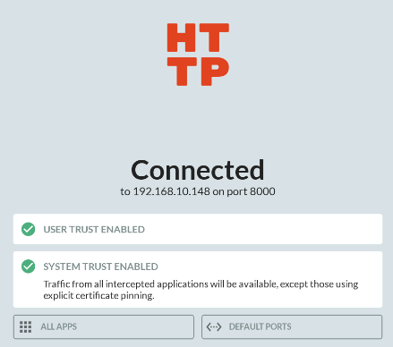
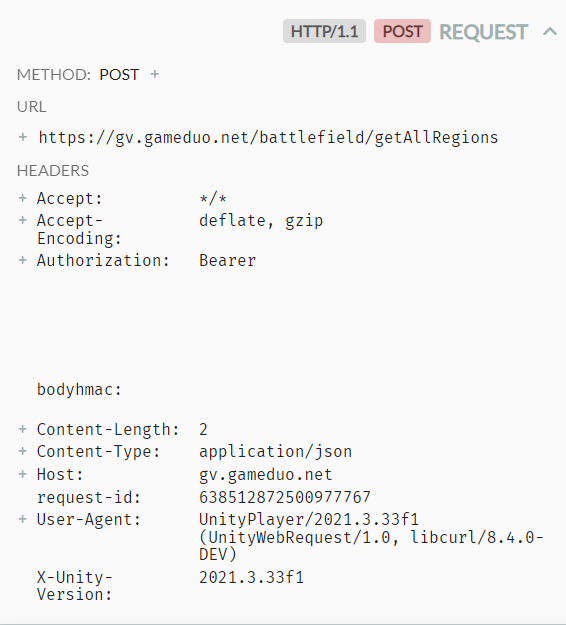

# Obtaining the Bearer Token

This guide will show you how to intercept the network traffic from a mobile game running on the BlueStacks emulator to obtain the bearer token needed for the Battlefield Tracker application. This process involves using BlueStacks, ADB (Android Debug Bridge), and HTTP Toolkit.

## Requirements

- **BlueStacks Emulator**: For running the mobile game on a PC.
- **ADB (Android Debug Bridge)**: For managing communication between BlueStacks and your PC.
- **HTTP Toolkit**: For intercepting and analyzing network traffic.

## Installation and Setup

### Step 1: Install BlueStacks

1. **Download BlueStacks**:
   - Visit the [official BlueStacks website](https://www.bluestacks.com) and download the latest version compatible with your operating system.
   - Install BlueStacks by following the on-screen instructions.

### Step 2: Install ADB

2. **Download ADB**:
   - Go to [Android's official site](https://developer.android.com/studio/releases/platform-tools) and download the ADB platform tools.
   - Extract the downloaded ZIP file to a known location on your PC.
   - **Add ADB to your system's PATH**:
     - **Windows**:
       1. Search for and open `System Properties`.
       2. Click on `Advanced system settings`.
       3. Click on the `Environment Variables` button.
       4. In the `System variables` section, find and select the variable named `Path`, then click `Edit`.
       5. Click `New` and add the path to the folder where you extracted the ADB tools (e.g., `C:\path\to\adb`).
       6. Click `OK` to close all dialog boxes.
       7. Verify that ADB is in the path by typing:
          ```bash
          adb version
          ```

### Step 3: Install HTTP Toolkit

3. **Install HTTP Toolkit**:
   - Download HTTP Toolkit from [its official website](https://httptoolkit.tech/).
   - Follow the installation instructions to set up HTTP Toolkit on your PC.

### Step 4: Root BlueStacks by Editing the Configuration File

4. **Edit the BlueStacks Configuration File**:
   - Navigate to `C:/ProgramData/BlueStacks_nxt` on your PC.
   - Find and open the `conf` file using Notepad or another text editor.
   - Search for the line `bst.feature.rooting=` and change the value from `0` to `1`.
   - Search for the line related to your emulator name, then find `enable_root_access=` and change the value from `0` to `1`.
   - Save the changes and close the file.

### Step 5: Enable ADB on BlueStacks

5. **Enable ADB**:
   - Launch BlueStacks.
   - Go to `Settings > Preferences`.
   - Enable Android Debug Bridge (ADB) integration.
   - Take note of ADB address
   [Enable ADB on BlueStacks](./enableADB.png)

### Step 6: Connect to BlueStacks Using ADB

6. **Connect your PC to BlueStacks via ADB**:
   - Open a command prompt or terminal.
   - Navigate to the directory where you extracted ADB. (can skip if you added to path)
   - Type the following command to connect:
     ```bash
     adb connect localhost:5565
     ```
   - Verify the connection by typing:
     ```bash
     adb devices
     ```
     This command should list your BlueStacks instance as a connected device.

### Step 7: Configure HTTP Toolkit

7. **Set up HTTP Toolkit to intercept BlueStacks traffic**:
   - Open HTTP Toolkit.
   - Select to intercept traffic from BlueStacks.
   - Follow the on-screen instructions to install HTTP Toolkit's SSL certificate on BlueStacks, allowing it to decrypt HTTPS traffic.
   - If installed correctly you should see the System Trust Enabled with a green checkmark.
   


### Step 8: Capture the Bearer Token

8. **Start intercepting data**:
   - With HTTP Toolkit running, start the game in BlueStacks.
   - Navigate to the part of the game where it connects to its servers (e.g., entering the battlefield).
   - HTTP Toolkit will capture the HTTP and HTTPS requests and responses.
   - Look through the captured data for API calls to the game's server. Examine the request headers for an `Authorization` field, which will contain the bearer token, HMAC and request id
   
   


After completing these steps, you should have the bearer token necessary for accessing the game's API for your application.