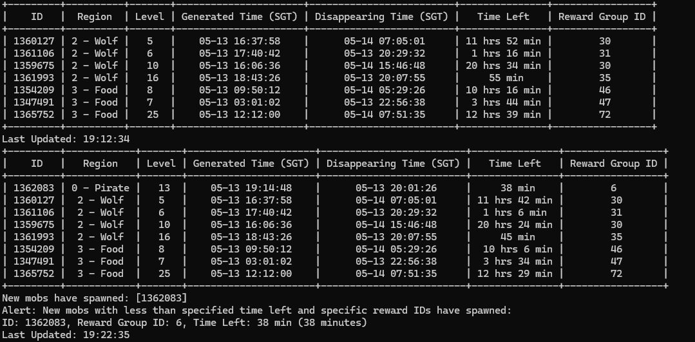

# Battlefield Monitoring Tool

**This method has been patched and no longer works.**
**For a lousier version see: [Here](https://github.com/keyule/Battlefield-Tracker2)**


This Python script is designed to monitor and report on battlefield conditions and mob spawns in a specific online game. It connects to the game's API to fetch real-time data about active battlefields, including their ID, region, level, time information, and reward groups. The script tracks changes over time and alerts users when new mobs that meet certain criteria appear.

## Features

- **Real-time updates:** Automatically fetches and updates battlefield information every 10 minutes.
- **Alert system:** Notifies users of new mob spawns that meet specific time and reward criteria.
- **Data presentation:** Displays battlefield information in a clear and structured table format.

## Screenshot


## Requirements

- Python 3.8 or newer
- Requests
- PyTZ
- Python-dotenv
- PrettyTable
- python-telegram-bot
- python-telegram-bot[job-queue]

## Installation

1. Clone this repository or download the script to your local machine.
2. Install the required Python packages:

```bash
pip install requests pytz python-dotenv prettytable python-telegram-bot
```
3. Ensure that you have the necessary environment variables set. You can do this by creating a .env file in the same directory as the script with the following contents:
```plaintext
BEARER_TOKEN=your_bearer_token_here
BODY_HMAC=your_body_hmac_here
REQUEST_ID=initial_request_id_value
TELEGRAM_TOKEN=your_bot_token
TELEGRAM_CHAT_ID=your_id_here
TELEGRAM_ALERTS_ENABLED=False
```
Replace your_bearer_token_here(this is no more needed), your_body_hmac_here, and initial_request_id_value with your actual credentials and the initial request ID.

You can leave the telegram stuff alone

For detailed instructions on how to obtain the BEARER_TOKEN, refer to our [Guide on Obtaining the Bearer Token](./Guide/README.md). This guide provides step-by-step instructions to capture the necessary token through network interception using tools like BlueStacks and HTTP Toolkit.

> Note: The Bearer Token will expire and is needed to be changed daily, so you will have to do all those steps everyday. When you get an error and the thing stops running, means its time to change your token. 

## Usage
To run the script, simply execute it from the command line:
```bash
python battlefield.py -token YOUR_BEARER_TOKEN_HERE
```

## Configuration
- Minimum time left for alerts (min_time_left): Set this value to change the threshold for the time left alerts.
- Reward IDs (reward_ids): Specify which reward IDs should trigger alerts when they appear on new mobs.
- Timezone: To modify it to your timezone, just throw the whole script into chatgpt and ask it to help you modify it 

These configurations can be adjusted directly in the script.

## Update (20/5/2024)
- Refactored everything
- New way to start the script
- Now prompts you to update the token if it changes. 
```bash
Bearer token has expired or is invalid. Please enter a new bearer token:
```
